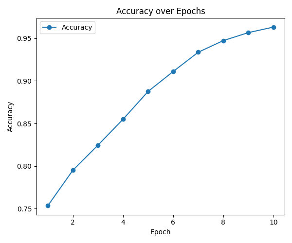
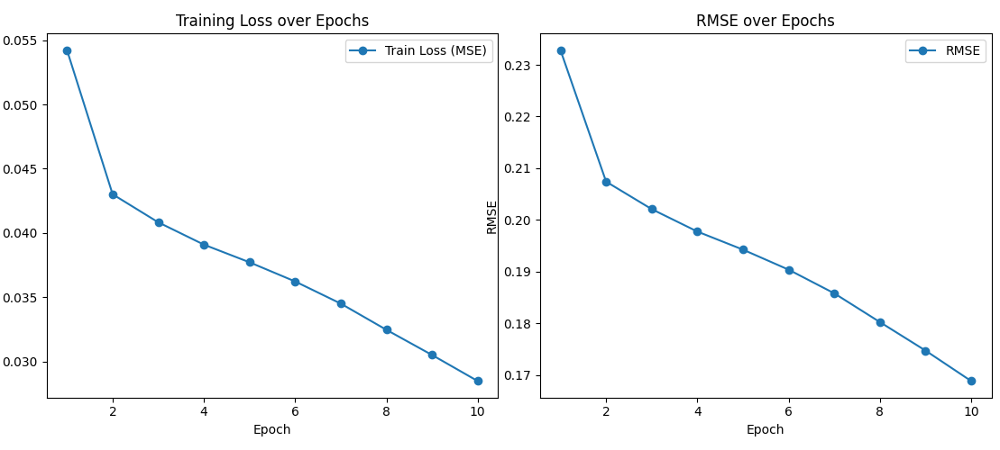

ncf.py : NCF(neural collaboration filtering) implementation as binary classification (recommend or not)

ncf2.py : NCF as regression (ratings prediction)

# ncf.py Result 

# ncf2.py result

image from Kaggle https://www.kaggle.com/datasets/arashnic/book-recommendation-dataset

## deep learning recommendation system

image from Kaggle https://www.kaggle.com/datasets/arashnic/book-recommendation-dataset

## taxonomy

image from Kaggle https://www.kaggle.com/datasets/arashnic/book-recommendation-dataset